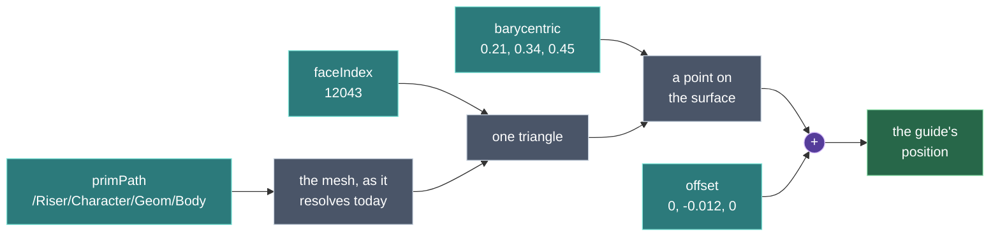
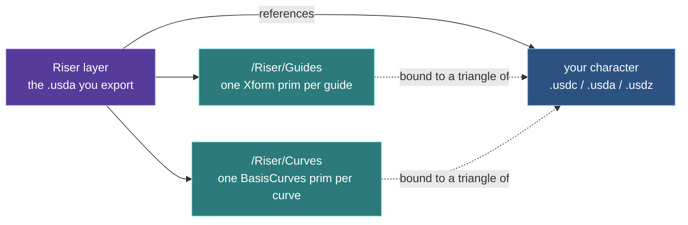
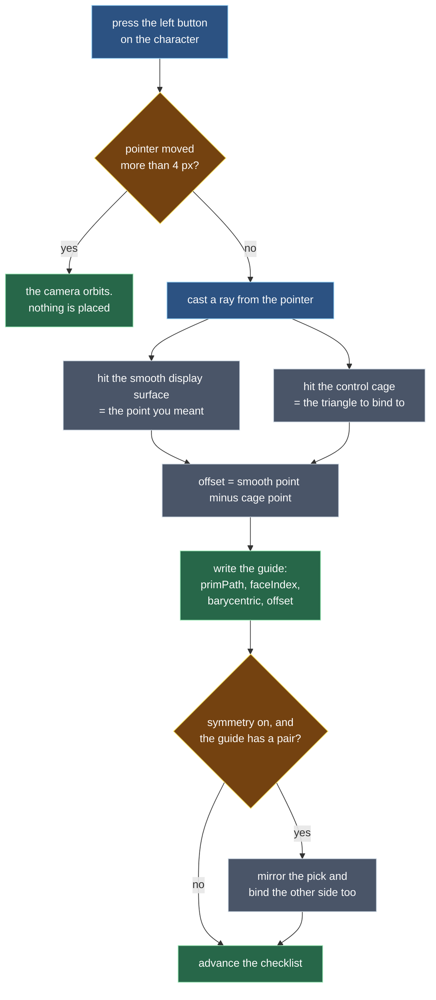
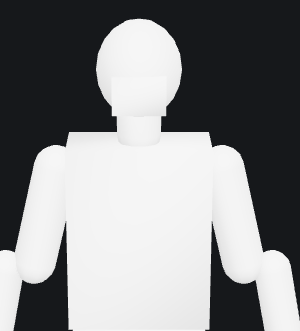
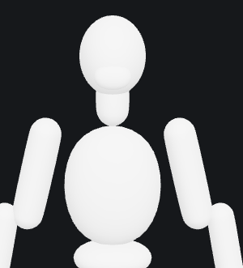

# Concepts

A short list of ideas carries the whole application. If you hold these,
everything in the interface follows.

- [Templates and the checklist](#templates-and-the-checklist)
- [Guides and curves](#guides-and-curves)
- [Surface bindings](#surface-bindings)
- [Interior guides](#interior-guides)
- [Symmetry](#symmetry)
- [X-ray](#x-ray)
- [The subdivision preview](#the-subdivision-preview)
- [Provenance: who placed this](#provenance-who-placed-this)
- [Where documents live](#where-documents-live)

## Templates and the checklist

A **template** is a named list of what a character of a given kind needs: which
guides to place, which curves to trace, in what order, and which of them are
optional. Riser ships three, chosen from the toolbar: Biped, Quadruped and Face
only. See [templates.md](templates.md) for what each one asks for.

The template is not a suggestion, it is the tool state. The left rail shows the
template as a checklist, and the highlighted row is what your next click on the
mesh will place. When you place something, the checklist advances to the next
unplaced entry on its own, so the normal way to work is to click your way down
the list without touching it.

Changing template mid-document drops any guides and curves the new template
does not define. Switching from Biped to Face only keeps your eye and mouth
guides and discards the legs.

## Guides and curves

A **guide** is a single named point: `wristL`, `noseTip`, `chest`. It has a
position, a surface normal, and a binding.

A **curve** is a named run of control vertices laid along the surface:
`jawline`, `lipUpper`, `spineCurve`. Each control vertex is bound the same way
a guide is. A curve can be open or closed, and carries a width that is written
into the USD layer as the standard `widths` attribute.

Use a guide for a thing with one location, such as a joint centre. Use a curve
for a thing with a shape, such as the edge of a lip.

## Surface bindings

This is the load-bearing idea, and the one worth reading twice.

Riser does not record where you clicked. It records **where you clicked on the
character**: which mesh, which triangle of it, and whereabouts inside that
triangle, plus an optional displacement off the surface.

In one line:

    position = evaluate(primPath, faceIndex, barycentric) + offset

A bare position is only true for the exact mesh it was picked on. Retopologise
the character, swap it for a higher-resolution build, or change its scale, and
every stored position is quietly wrong. A binding survives all three, because
the position is recomputed from whatever geometry the reference resolves to
rather than remembered.

Two consequences that change how you work:

- **You can swap the mesh.** Load a different build of the same character and
  your markers re-seat themselves onto it. Riser rebuilds every marker from its
  binding, not from its stored position, so this is the normal path rather than
  a recovery procedure.
- **The server recomputes rather than trusts.** The stored position is a hint.
  The authoritative value is what OpenUSD gets when it evaluates the binding
  against real geometry, which is why the inspector shows you the binding and
  not just a coordinate.

A guide can legally have no binding, and the inspector says *nothing - free in
space* when that happens. It means the position is all anyone has to go on.

### The document

What you export is a USD layer that references your character and adds guides
and curves beside it. The asset itself is never touched.

Because the character is referenced rather than copied, the layer stays small
and the asset stays authoritative. Update the character and the layer picks up
the new one.

### What happens on a click

The four-pixel threshold is what lets one mouse button both orbit and place. A
press that does not move is a click; a press that moves is a tumble.

## Interior guides

A shoulder centre, a hip socket and an eyeball are not surface features. They
sit inside the volume, and no click on the skin is the right answer for them.

Guides like this are marked **interior** in the template, shown as **IN** in the
checklist, and handled like this:

1. You click on the skin, as usual, which fixes *where along the body* the
   guide is.
2. Riser pushes it slightly below the surface straight away, so you are
   adjusting rather than starting from scratch.
3. You **alt-drag** the marker to set the depth. Dragging down pushes it
   further in; dragging up brings it back out.

The depth is stored in the binding's `offset`, along the guide's normal, so the
guide is still anchored to a triangle. Slide it across the surface afterwards
with an ordinary drag and it keeps the depth you gave it.

## Symmetry

Characters are modelled symmetric about their own centre line, so Riser mirrors
across that plane: local x = 0. With **Symmetry** on, placing a guide that has a
mirrored counterpart in the template places both, in one undo step. Curves
behave the same way, point by point.

Mirroring is not just a sign flip. A binding has to name a real triangle, so
Riser reflects the point and then casts a ray back at it to find actual
geometry on the far side. If there is nothing there, because the character is
asymmetric or an arm is behind the back, it tells you in the status bar and
places only the side you clicked. It will not fabricate a binding.

A consequence worth expecting: a mirrored pair is not numerically exact. The
triangulation of a mesh is rarely perfectly symmetric, so the two sides can
land a millimetre or two apart. That is the mirror binding to real geometry
rather than inventing a position.

## X-ray

**X-ray** draws markers and curves through the mesh instead of letting the
surface hide them. It is on by default, and it is what makes interior guides
visible at all: a hip centre is inside the body, so without x-ray you would be
adjusting something you cannot see.

## The subdivision preview

Riser displays your character as a smooth Catmull-Clark surface, at the level
set by the **Subdiv** slider (0 to 3, default 2). Level 0 shows the raw mesh.

| Subdiv 0, the control cage | Subdiv 3, the limit surface |
|---|---|
|  |  |

The point is not that it looks better, although it does. It is that placing an
eye corner on a faceted blockout means aiming at a flat plane that is nowhere
near where the eye corner really is.

**Changing the slider never moves a marker you have already placed.** This is
worth being clear about, because it looks as though it should.

A binding always names a triangle of the original mesh, never of the smooth
result. When you click, Riser casts against both surfaces at once: the smooth
one gives the point you actually meant, and the original mesh gives the
triangle to bind to. The gap between the two is recorded as the binding's
`offset`. So the recorded answer is the point you clicked, expressed against
geometry that does not change when the preview does.

That also means nothing downstream needs to know about subdivision. The server
recovers your exact point with no subdivision code at all.

Smoothing starts **off**, at level 0. The character appears exactly as its file
describes it, and smoothing is something you turn on rather than something
applied to your asset before you have seen it. Level 0 is also the surface your
bindings are really written against, which makes it the honest thing to open
with.

Every level you visit is kept, so returning to one you have already used is
instant rather than a fresh refinement.

If a character is too heavy for the level you ask for, Riser shows the highest
one it can and says so in the status bar, naming the face count. The budget is
counted across the **whole character**, not per mesh - a production asset
arrives as thirty or forty pieces, each small enough to look harmless on its
own while the sum is far too heavy to subdivide.

## Provenance: who placed this

Every guide records how its position was arrived at, and the inspector shows it
as **Source**:

| Source | Meaning |
|---|---|
| `user` | You placed or adjusted it. Never overwritten. |
| `skeleton` | Read from the character's own rig. Exact, when there is a rig. |
| `proportions` | Measured from the mesh's shape. Approximate, and used when there is no rig. |
| `landmarks` | Predicted from the character's appearance. |

This is not bookkeeping. Automatic placement runs more than once, on load and
whenever you press **Auto-place**, and it must never undo work you did by hand.
Provenance is what lets it improve its own guesses and leave yours alone.

The tiers are tried best first. A skeleton is exact, so it always wins. Failing
that, Riser measures the character. That is a fallback and says so through the
confidence it records, which the inspector shows beside the source.

**What gets measured depends on the template you chose**, because the two body
plans are measured along different axes:

| Template | How it is measured |
|---|---|
| Biped, Face | Sliced by **height**: where the legs stop, where the torso narrows, how far the arms reach. |
| Quadruped | Sliced along its **length**: where the two leg pairs sit, how far apart they are, where the topline runs and where the belly is. |

The quadruped measurement assumes no particular animal. Leg positions come from
the two groups of geometry near the ground, and the joints up each leg are
placed as fractions of the measured belly-to-ground distance, so a dachshund
gets dachshund legs. Which end the head is on is read from the topline, since a
quadruped's highest point is its skull or its ears.

If the shape does not measure like the template you picked - a horse under the
biped template, or something taller than it is long under the quadruped one -
Riser places nothing and tells you so, rather than scattering guides in the
wrong places. Switching to the right template and pressing **Auto-place** is
usually all that is needed.

In the checklist and the viewport, a guide the app placed shows **violet**;
one you placed or adjusted shows **blue**. Touch an automatic guide in any way
and it becomes yours.

## Where documents live

Your work is kept in the browser, in two separate places.

**The session.** Whatever you have open is written back shortly after it stops
changing, and restored when you return. Closing the tab, refreshing, or a crash
costs you nothing. Restoring deliberately does not re-run automatic placement,
so a refresh never replaces your own markers with guesses.

**Named documents.** The session is a single slot, so a second character would
write over the first. The **Documents** menu keeps as many as you like:

- **Save** updates whichever document is open.
- **Save as** names a new one.
- **New** starts a fresh document, keeping the character that is loaded.
- Clicking a document in the list reopens it, and reloads its character.

Reopening restores the layer and the mesh together, but only when the character
came from a bundled asset or a URL. An uploaded file cannot be fetched again -
those bytes were in your file picker and were never Riser's to keep - so the
document comes back and Riser asks you to reopen the mesh.

Documents live in this browser, on this machine. Nothing is on a server yet, so
they do not follow you to another computer, and clearing site data removes them.
**Export USD** is what produces a file you own.

The status bar shows **Unsaved changes** or **Saved**, and both **Export USD**
and **Documents** carry a bullet while there is anything unsaved.

The document is stored as USD layer text and nothing else, in the file you
export and in every planned storage backend. There is no second format, so what
you save is exactly what the server opens.
