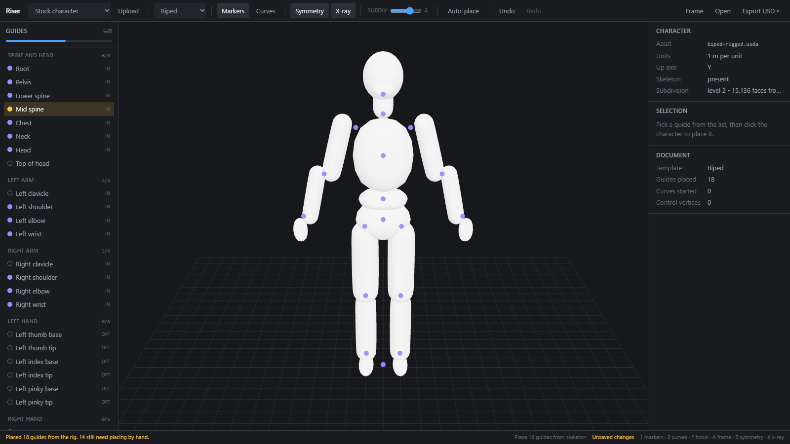
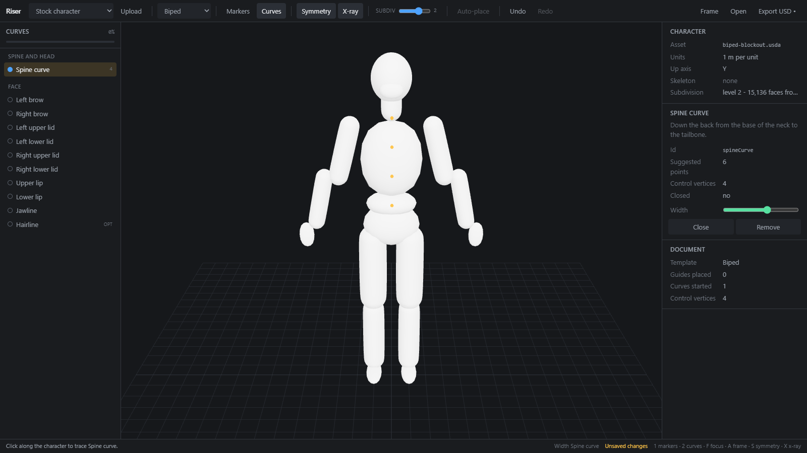

# Getting started

A path from an empty checkout to an exported USD layer. It takes about five
minutes.

## 1. Install and run

You need Node and npm. Continuous integration builds on Node 22, so that is the
safe choice.

```bash
npm install
npm run dev
```

Open <http://localhost:5173>. You get an empty grid and a checklist down the
left, and the status bar tells you what to do next: *Load a character to
begin.*

## 2. Load a character

Open the **Stock character** dropdown at the far left of the toolbar and choose
**Biped (blockout)**. The character loads, the camera frames it, and the
inspector on the right fills in what Riser read from the file: the asset name,
its units, its up axis, and whether it carries a skeleton.

Three characters are bundled:

- **Biped (blockout)**, a plain two-legged figure with no rig.
- **Quadruped (blockout)**, a four-legged figure with no rig.
- **Biped (rigged)**, the same biped carrying a real UsdSkel skeleton.

You can also load your own: use the **Upload** button, or drop a file on the
viewport. Riser reads `.usd`, `.usda`, `.usdc`, `.usdz`, `.glb`, `.gltf`,
`.fbx` and `.obj`.

## 3. Place your first marker

The left rail is the checklist. It lists everything the current template asks
you to place, grouped by body part, with a progress bar at the top.

1. Click **Chest** in the *Spine and head* group. The row highlights, and the
   status bar reads *Click the character to place Chest.*
2. Click the character's chest in the viewport.

A marker appears where you clicked, the row's dot turns blue, and the checklist
moves on to the next unplaced guide by itself. Keep clicking to work down the
list.

A click means press and release without moving. If you move more than a few
pixels the gesture becomes a camera tumble instead and nothing is placed, so
you can orbit freely with the same button you place with.

### Symmetry does the other side

**Symmetry** is on by default. Guides that come in pairs (left and right elbow,
say) are placed on both sides from one click, in a single undo step. Place the
**Left elbow** and the right one appears too.

If the mirrored point has no surface to bind to, Riser tells you in the status
bar and places only the side you clicked, rather than guessing.

### Guides that live inside the body

Most joint centres are not on the skin. An elbow centre is in the middle of the
arm. Guides like this are marked **IN** in the checklist, and Riser pushes them
slightly below the surface when you place them.

To set the depth yourself, hold **Alt** and drag the marker. Dragging down
pushes it further in, dragging up brings it out. Drag without Alt and the
marker slides across the surface instead.

### If the character is rigged

Load **Biped (rigged)** and Riser reads the guides straight out of the rig the
moment the file opens. The markers it places are violet rather than blue, which
means the app guessed and you have not confirmed the position yet.



Nothing here is final. Drag any marker and it becomes yours, turns blue, and no
later automatic pass will touch it. The **Auto-place** button re-runs the same
pass at any time and always leaves your own placements alone.

## 4. Draw your first curve

Press **2**, or click **Curves** in the toolbar. The checklist switches to the
list of curves.

1. Click **Spine curve** in the list.
2. Click along the character's back, from the base of the neck downwards.

Each click adds a control vertex. New vertices are inserted where they fit
along the curve rather than always at the end, so you can work outwards from
the middle of a jawline in both directions without the curve zig-zagging.

- Drag a control vertex to slide it along the surface.
- Select one and press **Delete** to remove it.
- Press **C** to close the curve into a loop, or open it again.



## 5. Export

Click **Export USD**. Your browser downloads a `.usda` file: a USD layer that
references the character and carries every guide and curve you placed.

The bullet beside the button means you have unsaved changes. Exporting clears
it.

That file is the deliverable. It opens in any USD tool, and it is what the
server-side systems read. See [what do I do with the exported
.usda](faq.md#what-do-i-do-with-the-exported-usda) for what is inside it.

> **Your work is not saved automatically.** Riser keeps no copy between page
> loads. Export before you close the tab, and use **Open** to load a `.usda`
> layer back in and carry on.

## Where to go next

- [Concepts](concepts.md) explains surface bindings, which is the idea that
  makes any of this durable.
- [Templates](templates.md) says where each guide actually goes.
- [Keyboard and mouse](keyboard.md) is the full shortcut list.
