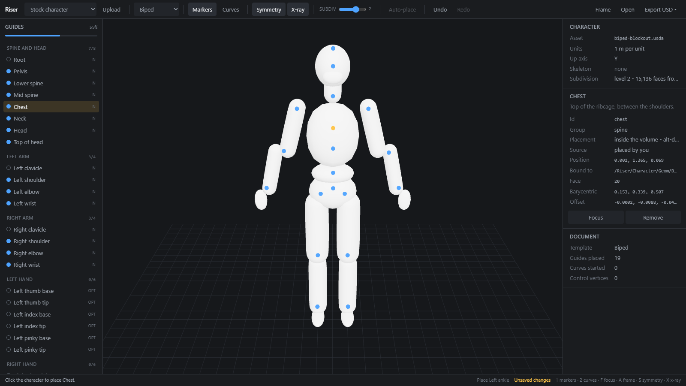
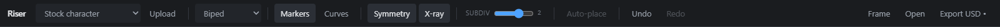
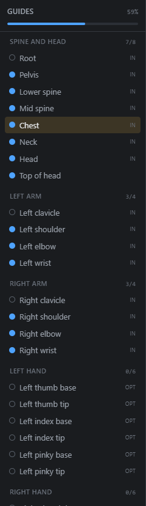
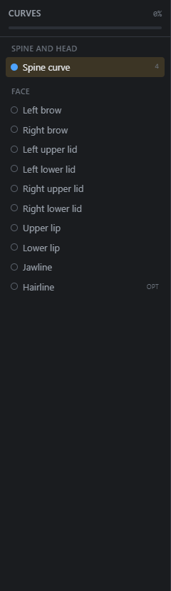
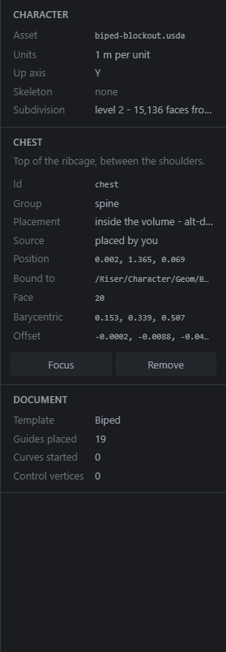
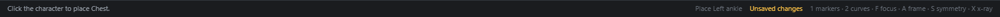

# The interface

Riser has a menu bar, a toolbar, three panels and a status strip.

- The **menu bar** across the top: everything Riser can do. Every action
  appears here, whether or not it also has a button.
- The **toolbar** under it: the few things you reach for constantly.
- The **markers panel** down the left: what to place, and what is next.
- The **viewport** in the middle: where you click.
- The **details panel** down the right: what exactly is selected.
- The **status bar** along the bottom: what to do next, and anything the app
  needs to tell you.

Both side panels can be **resized** by dragging their inner edge, and
**collapsed** to a labelled rail by clicking the chevron in their header or
double-clicking that edge. Widths are remembered between visits.
**View › Reset panels** puts everything back.

## Menu bar

The toolbar can only hold what fits, so the menus hold everything. If you
cannot find a control, it is in a menu.

| Menu | What is in it |
|---|---|
| **File** | New, Save, Save as, the bundled characters, opening your own file, recent documents, importing a marker layer, and Export USD. |
| **Edit** | Undo, Redo, automatic placement, confirming suggestions, mirroring, and clearing markers or curves. |
| **View** | Shading, what is drawn, step-by-step guidance, framing, and resetting the panels. |
| **Template** | Which rig layout to place: Biped, Quadruped or Face only. |
| **Help** | Documentation, and the keyboard shortcuts. |

The version beside the Riser wordmark is a button. Clicking it shows what
changed in each release, with every entry labelled **Added**, **Fixed** or
**Changed** so a new feature is easy to tell from a repair. An entry under a
heading Riser has no colour for still shows, with a neutral label, because
losing an entry is worse than showing one in grey.

Items you cannot use right now are shown greyed out rather than hidden, so it
stays possible to learn that they exist.

## Toolbar

Left to right.

| Control | What it does |
|---|---|
| **Select** / **Markers** / **Curves** | Switches the active tool. Also `1`, `2` and `3`. **Select** moves what is already placed and never adds anything, so a click that misses is safe. |
| **Mirror** | Mirrors placements across the character's centre line, and shows the symmetry plane in the viewport. On by default. Also `S`. |
| **Placement** | Where a click lands: on the surface, inside the volume, or free. See below. |
| **Auto-place** | Fills in markers automatically: from the character's own skeleton when it has one, otherwise by measuring its shape. Disabled until a character is loaded. Never overwrites anything you placed. |
| **Shading** | How the character is drawn: Lit, Flat, Wire or Lit wire. See below. |
| **Show** | What is drawn: the character, markers, curves, the skeleton, the ground grid, and whether markers show through the body. The button turns amber and counts what is hidden, so nothing can be invisible without the interface saying so. |
| **Smooth** | Turns smoothing on and off, accent blue while it is on. The three-dot button beside it chooses the level, 0 to 3. Display only: it never moves a marker you have placed. See below. |
| **Undo** / **Redo** | Steps the document history. The tooltip names the step, for example *Undo Place Chest*. |
| **Frame** | Frames the whole character. Also `A`. |

Saving, loading and exporting live in the **File** menu.

### Where clicks land

A marker is not always meant to sit on the skin. A joint is inside the limb,
and how far inside depends on how thick that particular limb is.

| Mode | Where the marker goes |
|---|---|
| **Auto** | The template decides. Guides it marks as interior - hips, shoulders, elbows, knees - go to the centre of the volume; everything else goes on the surface. The default, and right for almost everything. |
| **On surface** | Always on the skin, whatever the template says. |
| **Centre of volume** | Always in the middle of the limb or body under the cursor. |
| **Free** | Wherever you put it. Dragging moves the marker in the plane of the screen instead of sliding it along the mesh, so it can be placed off the character entirely. |

**Centre is measured, not estimated.** The ray from your click enters the front
of the limb and leaves through the back; the marker goes halfway between. That
is right on a thin wrist and a heavy thigh on the same character, and on a
dachshund's leg and a giant's arm, without knowing anything about anatomy.

If the ray never comes back out - an open mesh, or a click right on the
silhouette - Riser places the marker at an estimated depth and says so in the
status bar. That is the one case where it is guessing, so it tells you.

**Mirror** makes a curve symmetric, in whichever sense it needs. A left or right curve rebuilds its counterpart from itself. A curve drawn across the centre line, like a lip or a jawline, keeps the half you drew, rebuilds the other half as its reflection and puts the middle point on the line. A curve drawn along the centre line, like a spine, is held on it.

Guides on the centre line stay there on their own: root, pelvis, spine, chest, neck and head cannot be dragged off the plane, because a spine that drifts sideways is nearly invisible here and very visible in a rig built from it.

**Clear** empties a curve and leaves it selected, so the next click on the character starts it again from nothing. **Remove** deletes it outright.

Curves are drawn through the points you place and are not pulled onto the surface. Between two points the line takes the shortest smooth path, so on a strongly curved feature it can sit slightly inside or outside the skin; another point fixes it. Riser used to re-seat the line on the surface automatically, and around an eye that read as the curve leaving the points it was drawn from and wrapping the eyeball, so it no longer does.

Curves take the same modes. Curves are usually surface features, so **Auto**
leaves them on the skin; **Centre of volume** is how you run a spine curve
through the torso rather than down the back. A curve placed inside the body is
not pulled back onto the surface for display, the way a surface curve is.

Whatever the mode, a marker is always bound to a triangle of the character.
That is what lets the server recompute its position against new geometry, and
what makes a marker survive a retopo.

### Smoothing

Riser opens with smoothing off, showing the character exactly as the file
describes it. Smoothing is something you turn on, not something applied to your
asset before you have seen it. Off is also the surface your markers are really
written against.

**Smooth** is a toggle and the three-dot button beside it holds the levels.
That split follows how the control is used: smoothing goes on and off far more
often than the level changes. Turning it back on returns to the level you last
chose.

The two are independent, so **level 0 with smoothing on** is a real choice and
not another way of switching it off. It shows the mesh exactly as the file
describes it, drawn as quads rather than as the triangulation it arrived in,
which is usually what you want while judging edge flow.

Each level you visit is kept, so moving the slider back to one you have already
used is instant.

If a level is too heavy for the character, Riser shows the highest one it can
and says so in the status bar, naming the face count. A very dense character
may be held at level 1 or 0 - that is the mesh being already detailed enough,
not a failure.

### Shading

Four ways to draw the character. Each answers a question the others cannot.

| Mode | What it is for |
|---|---|
| **Lit** | The character as its own materials describe it. The default. |
| **Flat** | Faceted shading, so every polygon's own plane is visible. Smooth shading hides topology. Most useful at Subdiv 0, since a subdivided surface has facets too small to see. |
| **Wire** | Edges only, seen through. The clearest way to judge whether a guide meant for a joint centre is really inside the limb rather than stuck to the near side of it. With smoothing on, the edges follow the quads rather than the triangles underneath them. |
| **Lit wire** | Lit surface with its edges drawn over, for placing on a dense mesh where the silhouette alone does not show where an edge loop runs. |

Shading is display only. It never moves a guide, and you can place and drag
markers in any mode, including through an invisible surface in **Wire**.

## Details panel

The right panel has two tabs.

**Details** describes whatever is selected: where a marker sits, what it is
bound to, how far below the surface it is, and where it came from. It also
carries the character's own facts (units, up axis, whether it has a rig) and,
when the character has them, its blend shapes.

**Scene** lists every piece the character is made of.

**Animation** plays a clip on the loaded character so you can check your
markers against motion.

### Scene

A production character is not one mesh. Gary is 33 separate pieces with
clothing layered over skin, and the list answers the two questions that
follow from that.

**Which piece is this?** Select a row and that piece lights up in the
viewport. The row shows its triangle count, whether it is skinned by the
character's rig, and how many materials it carries. More than one material
means the piece renders as several subsets, which is not visible from the
viewport at all.

**How do I reach the one underneath?** Each row has an eye. Hiding a piece
takes it out of the viewport and out of the way of your clicks, so a marker
meant for the hip lands on the hip rather than on the spacesuit over it.
**Show all** brings everything back, and hiding is forgotten when you load a
different character.

Selection is driven from this list rather than by clicking the viewport,
because a click there already means "place a marker" and that is the job the
viewport is for.

### While a character loads

A character can be tens of megabytes, so loading one shows its progress: how
much has arrived out of how much there is, and then that it has moved on to
reading the file and building the character. Those last two are synchronous and
can take a moment on a heavy asset, which is why they say so rather than
leaving the bar sitting at 100%.

**Cancel** stops a download you did not mean to start. It appears only while
bytes are still arriving, because once they are all here there is nothing left
to stop. Cancelling leaves whatever character you already had alone and reports
nothing: it is a decision, not a failure.

**Recompute normals** decides whether shading follows a shape. Off, the
character keeps the normals its file came with: free, and exactly what the
artist shaded, but a strong shape is lit as though it had not moved. On, each
normal is turned by however far the surface turned under it, so a bulge lights
like a bulge. Turning it on roughly triples the cost of firing a shape, which
is why it is a choice.

The turn is applied to the normals the file authored rather than replacing
them. That matters because a file gives split vertices different normals
wherever it wants a hard edge, and rebuilding smooth normals from scratch
erases every crease on the character.

### USD

What the character's source file contains, as the file describes itself:
every prim, its type, and its attributes with their values. The Scene tab
shows the actor, the character as the thing you place markers on; this shows
the source it was built from. Both are true and they answer different
questions.

It is there for one recurring question: is the thing I am looking for actually
in this file. Searching **blendShape** on a character whose blend shapes were
never exported returns nothing, which is a different problem from a panel that
is not working, and telling those apart used to mean guessing.

Read-only by design. Riser writes a layer that references your character and
never modifies it, and an editable panel here would promise otherwise. The
view needs a USD to read, so it is empty for glTF, FBX and uploaded files.

### Blend shapes

Shown only when the character has any. Click a shape's name to fire it, or drag
its slider for a partial weight; **Reset all** clears them. Shapes with the same
name on several meshes move together, so a smile that spans the face, the teeth
and the tongue stays in one piece.

Nothing here changes the document. A marker is bound to a triangle of the
neutral mesh, and posing that mesh for a look does not change which triangle
that is.

### Animation

Clips a character shipped with are listed on load. **Add clips from a file**
takes glTF, FBX or USD, and a clip whose tracks name bones this character does
not have is refused, with the names it wanted, rather than played silently.
Riser does not retarget.

**A clip is opt-in.** A character that ships with animation still loads at its
rest pose, because that is the pose markers belong on: a binding names a
triangle of the resting mesh, and automatic placement measures the resting
silhouette.

Two things to know while a clip is playing:

- **Markers do not follow the deforming surface.** They stay where the resting
  mesh put them. That is the binding being honest rather than a glitch, but it
  means a marker will appear to detach from a moving limb.
- **Above Smooth 0 the smoothed surface does not move**, so the character
  appears frozen while the clock runs. Set smoothing to 0 to watch a clip.

## Markers panel

The left panel lists everything the current template asks for, grouped by body
part. It follows the active tool: markers while the marker tool is active,
curves while the curve tool is.

### Step-by-step

By default the panel opens with a card at the top showing **one** marker to
place, with the hint for it and where it goes. Place it and the card advances;
**Skip** moves on without placing.

Turn it off with the **x** on the card, or from **View › Step-by-step
guidance**, and the panel becomes the list alone. The choice is remembered.

### Finding things

A template can ask for forty markers, so the panel has a search box - `Ctrl+F`
focuses it - and four filters:

| Filter | Shows |
|---|---|
| **All** | Everything the template defines. |
| **Left** | Only what is still unplaced. |
| **Suggested** | Only what Riser placed for you, and you have not confirmed. |
| **Mine** | Only what you placed or adjusted. |

Groups fold away, and each carries a ring showing how much of it is done. A
search temporarily opens every group, so what matched is never hidden inside a
folded one.

### Right-click

Right-clicking a row offers: place it next, focus it in the viewport, confirm
it if Riser guessed it, and clear it. Right-clicking the viewport offers
framing, automatic placement, shading and visibility.

The highlighted row is the **active** entry, and it is what your next click on
the mesh will place. Click a row to make it active. After you place something,
the next unplaced entry becomes active by itself.

The percentage and the bar at the top count **required** guides only, so a
template can read 100% with optional guides still unplaced.

Each row carries a dot on the left:

| Dot | Meaning |
|---|---|
| Hollow ring | Not placed yet. |
| Amber | The active entry. Your next click places this. |
| Blue | Placed by you. |
| Violet | Placed automatically and not yet confirmed. Worth checking. |

And badges on the right:

| Badge | Meaning |
|---|---|
| **IN** | Interior. This guide belongs inside the volume, not on the skin. Alt-drag sets its depth. |
| **OPT** | Optional. Not counted in the progress bar. Hidden once placed. |
| A number | Curves only: how many control vertices the curve has so far. |

Group headings show how many of that group's guides are placed, such as `6/8`.

## Viewport

The viewport shows the character, a ground grid sized to fit it, and the
symmetry plane when symmetry is on.

**Camera.** Drag with the left button on empty space to orbit, drag with the
right button to pan, and use the wheel to zoom. Pressing and releasing without
moving is a click, and places rather than orbits.

**Clicking.** What a click does depends on the active tool and what is under
the pointer. See [Keyboard and mouse](keyboard.md) for the full table.

**Dropping a file.** Drag a character file anywhere onto the viewport and a
dashed outline appears; drop it to load. A file Riser does not read is refused
by name, with the supported list in the message.

**Messages.** A load in progress shows a small caption at the top. An error
shows a panel at the bottom with a **Dismiss** button, and stays until you
dismiss it.

## Inspector

The right panel has three sections. The middle one follows the active tool.

### Character

What Riser read from the file you loaded.

| Field | Meaning |
|---|---|
| **Asset** | The file name of the loaded character. |
| **Reference** | The asset path written into the exported layer, and editable. Defaults to a relative path beside the layer, which resolves when the two files sit in one directory. Point it at your pipeline path if the asset lives elsewhere. |
| **Units** | Metres per unit, as the asset declares it. |
| **Up axis** | `Y` or `Z`. |
| **Skeleton** | `present` or `none`. With a skeleton, Auto-place reads exact joint positions; without one it measures the shape instead, which is approximate. |
| **Subdivision** | The preview level and the face counts, as *level 2 - 15,136 faces from ...* the cage count. Reads *off* with the cage count at level 0. |

### Select mode

The mode for adjusting what is already there. Press on a marker or a curve
control vertex and it is selected and dragged, exactly as it would be in the
tool that created it: the drag re-seats it on the surface and rewrites the
binding, `alt` still lifts a marker off the skin, and mirroring still applies.

The difference is what happens when you miss. In marker mode a click on the
character places a marker, and in curve mode it extends a curve, so nudging
something you can see means every stray click leaves a new thing behind. In
Select a press that lands on nothing belongs to the camera, so you can orbit,
frame and adjust without adding anything.

Where a marker and a control vertex overlap on screen, which happens often
around the eyes and mouth, the marker takes the drag.

`Delete` removes whatever is selected, as it does in the owning tool.

### Selection, with the marker tool

The heading is the selected guide's label, followed by the template's hint for
it.

| Field | Meaning |
|---|---|
| **Id** | The guide's id in the document, such as `chest`. |
| **Group** | Its checklist group. |
| **Placement** | Shown for interior guides only, as a reminder that alt-drag sets depth. |

| **Source** | *placed by you*, or the automatic source with its confidence. |
| **Position** | The resolved position, in the character's own space. |
| **Bound to** | The USD prim path of the mesh it is bound to, or *nothing - free in space*. |
| **Face** | The triangle index within that mesh. |
| **Barycentric** | Where inside that triangle, as three weights that sum to 1. |
| **Offset** | Displacement from the surface point. Non-zero for interior guides. |
| **Nearest joint** | The closest joint of the character's rig and how far away it is. Shown only when the character has a skeleton. |

The binding fields are deliberately visible. When a marker ends up somewhere
unexpected, they are the thing that explains why.

**Focus** moves the camera to the guide. **Remove** deletes it.

### Selection, with the curve tool

| Field | Meaning |
|---|---|
| **Id** | The curve's id, such as `jawline`. |
| **Suggested points** | How many control vertices the template suggests. You are not held to it. |
| **Control vertices** | How many the curve has. |
| **Closed** | Whether it is a loop. |
| **Width** | The curve's width, written into the USD layer as `widths`. This is the width the exported curve has, not the thickness of the line on screen. |

**Close** / **Open** toggles the loop, the same as pressing `C`. **Remove**
deletes the whole curve.

### Document

A running total: the template, how many guides are placed, how many curves are
started, and how many control vertices there are altogether.

## Status bar

Left to right:

- **What to do next.** *Click the character to place Chest.* When every required
  guide is placed it says so and suggests exporting.
- **Notices** replace that text in amber when something needs saying, such as a
  mirrored guide that could not find a surface. They clear themselves after a
  few seconds.
- **The last edit**, which is also what Undo will step back, or *No edits yet*.
- **Saved** or **Unsaved changes**.
- A **shortcut reminder** on wide windows.
